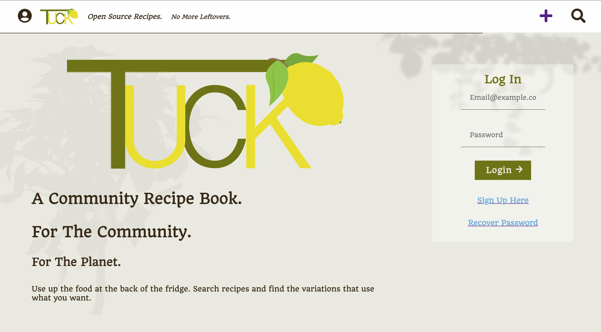
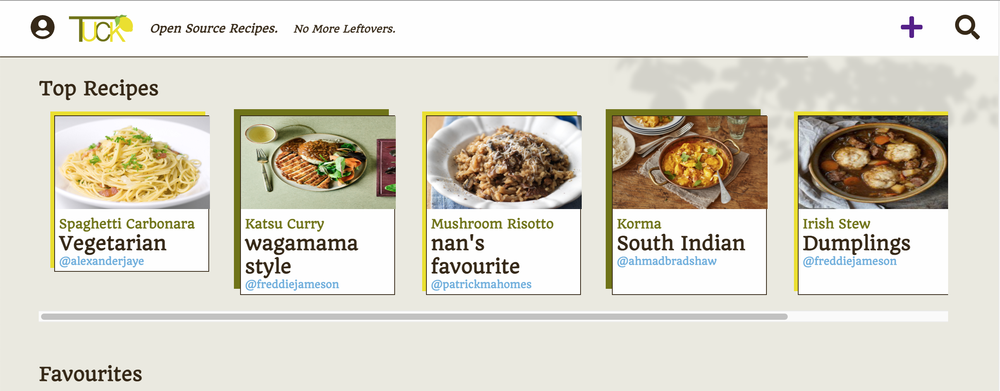
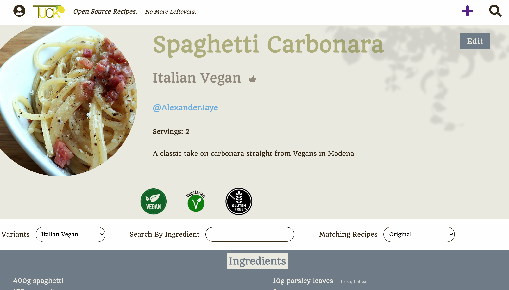
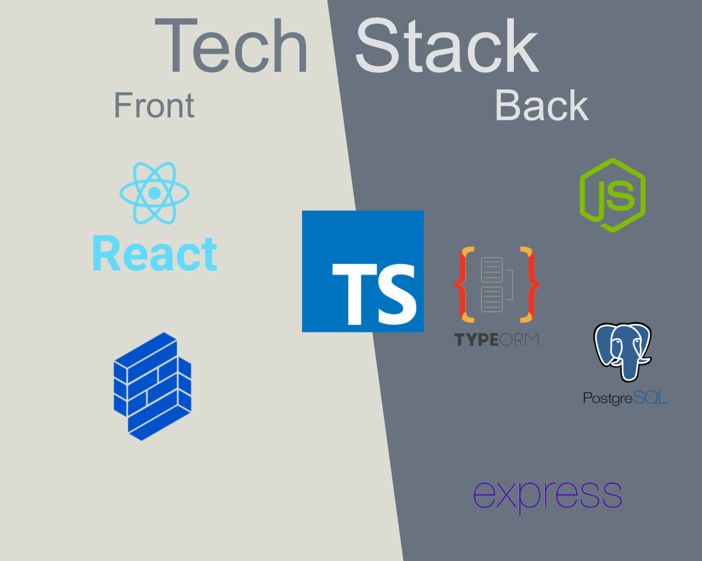

# Tuck
Tuck - a Full Stack, fully responsive web app for open source community recipes, encouraging users to share variations upon traditional recipes. Tuck reduces food waste by allowing users to filter by ingredient. 

Designed by Alexander Hall - [Github](https://github.com/alexanderjshall) - [LinkedIn](https://www.linkedin.com/in/alexanderjshall/)

[toc]

## Getting Started

1. In both the client directory & the server directory, run `npm install`.
2. In the client directory, run `yarn start`, and in the server directory run `npm start`-  *you will need to have postgres installed on your machine and have a database named 'tuck'*
3. Enjoy!

## Examples

## Tech Stack

